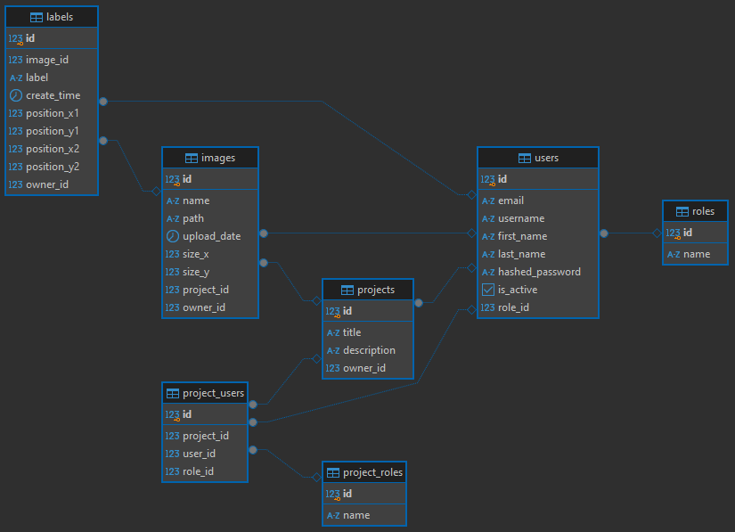

# Baza Danych PostgreSQL

Aplikacja wykorzystuje bazę danych PostgreSQL, która została zaimplementowana w kontenerze, co pozwala na łatwe zarządzanie i izolację środowiska bazy danych. Baza danych przechowuje dane dotyczące użytkowników, projektów, ról, etykiet oraz powiązań między tymi elementami. Zmienne środowiskowe są wykorzystywane do konfiguracji połączenia z bazą danych, co zapewnia elastyczność oraz bezpieczeństwo w różnych środowiskach (np. lokalnym, produkcyjnym).

## Struktura Bazy Danych

Baza danych składa się z kilku powiązanych ze sobą tabel, które przechowują dane o użytkownikach, rolach, projektach oraz powiązanych obrazach i etykietach. Poniżej przedstawiono szczegóły dotyczące każdego z modeli w aplikacji.

1. Tabela: `roles`

    Tabela ta przechowuje informacje o rolach użytkowników w systemie. Każda    rola ma unikalną nazwę.

    Kolumny:

    - id - Unikalny identyfikator roli.
    - name -  Nazwa roli (np. "Admin", "User").

2. Tabela: `users`

    Tabela przechowuje dane o użytkownikach, takie jak email, nazwa     użytkownika, imię, nazwisko oraz dane dotyczące hasła i aktywności  użytkownika. Użytkownicy mają przypisaną rolę z tabeli roles.

    Kolumny:

    - id - Unikalny identyfikator użytkownika.
    - email -  Unikalny adres email użytkownika.
    - username - Unikalna nazwa użytkownika.
    - first_name - Imię użytkownika.
    - last_name - Nazwisko użytkownika.
    - hashed_password - Zahashowane hasło użytkownika.
    - is_active - Flaga wskazująca, czy konto użytkownika jest aktywne  (domyślnie True).
    - role_id - ID roli użytkownika (odwołanie do tabeli roles).

3. Tabela: `projects`

    Tabela przechowuje informacje o projektach, w tym tytuł i opis projektu. Każdy projekt ma przypisanego właściciela, którym jest użytkownik z tabeli users.

    - id: Unikalny identyfikator projektu.
    - title: Tytuł projektu.
    - description: Opis projektu.
    - owner_id: ID właściciela projektu (odwołanie do tabeli users).

4. Tabela: `images`

    Tabela przechowuje dane o obrazach, które są przypisane do projektów. Zawiera informacje o nazwie obrazu, ścieżce, dacie przesłania, rozmiarach oraz właścicielu.

    - id: Unikalny identyfikator obrazu.
    - name: Nazwa obrazu.
    - path: Unikalna ścieżka do obrazu w systemie.
    - upload_date: Data przesłania obrazu.
    - size_x, size_y: Wymiary obrazu (szerokość i wysokość).
    - project_id: ID projektu, do którego należy obraz (odwołanie do tabeli projects).
    - owner_id: ID właściciela obrazu (odwołanie do tabeli users).

5. Tabela: labels

    Tabela przechowuje etykiety przypisane do obrazów. Etykiety zawierają informacje o pozycji na obrazie oraz czas ich utworzenia.

    - id: Unikalny identyfikator etykiety.
    - image_id: ID obrazu, do którego przypisana jest etykieta (odwołanie do tabeli images).
    - label: Treść etykiety.
    - create_time: Czas utworzenia etykiety.
    - position_x1, position_y1, position_x2, position_y2: Pozycja etykiety na obrazie, określona przez współrzędne prostokąta.
    - owner_id: ID użytkownika, który utworzył etykietę (odwołanie do tabeli users).

6. Tabela: `project_users`

    Tabela przechowuje powiązania między użytkownikami a projektami, a także przypisane role w kontekście danego projektu. Każdy użytkownik może mieć różne role w różnych projektach.

    - id: Unikalny identyfikator powiązania.
    - project_id: ID projektu (odwołanie do tabeli projects).
    - user_id: ID użytkownika (odwołanie do tabeli users).
    - role_id: ID roli użytkownika w projekcie (odwołanie do tabeli project_roles).

7. Tabela: `project_roles`

    Tabela przechowuje dostępne role użytkowników w kontekście poszczególnych projektów.

- id: Unikalny identyfikator roli w projekcie.
- name: Nazwa roli w projekcie (np. "Owner", "Member", "Modder").

## Diagram bazy danych

