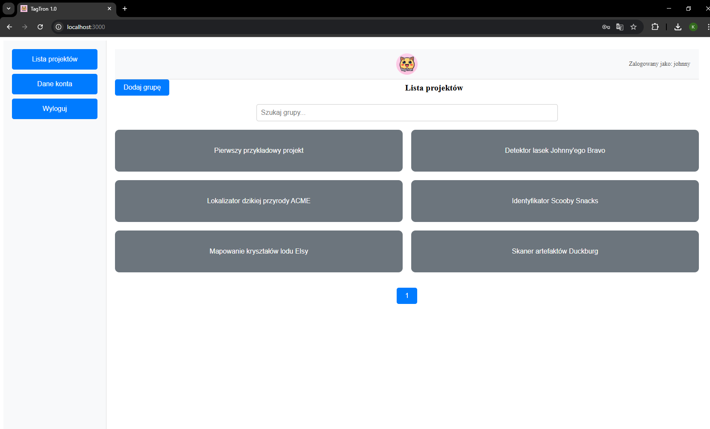
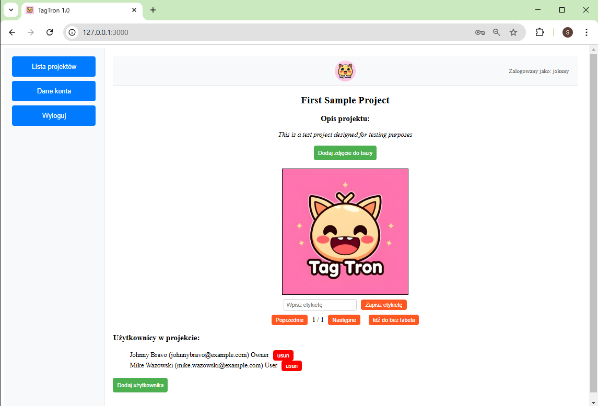

# Dokumentacja Frontendu

## Przegląd Projektu

Ta dokumentacja dotyczy frontendu projektu, który został zbudowany przy użyciu **React.js**. Poniżej znajduje się szczegółowy opis struktury, komponentów i plików użytych w frontendzie.

---

## Struktura Plików

```text
frontend/
├── .gitignore          # Plik ignorujący dla Git
├── Dockerfile          # Konfiguracja Dockera
├── eslint.config.js    # Konfiguracja ESLint
├── index.html          # Główny plik HTML
├── package-lock.json   # Plik blokady zależności
├── package.json        # Zależności projektu i skrypty
├── public/             # Zasoby publiczne
├── README.md           # Plik README projektu
├── src/                # Pliki źródłowe React
│   ├── .dockerignore
│   ├── AccountScreen.jsx      # Komponent ekranu konta użytkownika
│   ├── AddGroupModal.jsx      # Modal do dodawania nowej grupy
│   ├── App.css                # Style globalne
│   ├── App.jsx                # Główny komponent aplikacji
│   ├── assets/                # Zasoby statyczne, np. obrazy
│   ├── Canvas.jsx             # Komponent do rysowania
│   ├── ChangePasswordModal.jsx # Modal do zmiany hasła
│   ├── Content.jsx            # Główny komponent treści
│   ├── DockerFile             # Dodatkowy plik Dockera
│   ├── Header.jsx             # Komponent nagłówka/nawigacji
│   ├── ImageUploadModal.jsx   # Modal do przesyłania obrazów
│   ├── Login.jsx              # Komponent strony logowania
│   ├── main.jsx               # Punkt wejścia aplikacji React
│   ├── Menu.jsx               # Komponent menu nawigacyjnego
│   ├── ProjectsScreen.jsx     # Komponent ekranu projektów
│   ├── Register.jsx           # Komponent rejestracji
│   ├── UserAddModal.jsx       # Modal do dodawania użytkowników
├── vite.config.js       # Konfiguracja Vite
```

---

## Kluczowe Komponenty React

### 1. `App.jsx`

- **Cel:** Główny komponent organizujący układ i strukturę aplikacji.
- **Funkcje:**
  - Integracja routingu.
  - Łączenie kluczowych komponentów, takich jak `Header` i `Content`.

### 2. `Header.jsx`

- **Cel:** Wyświetla nagłówek lub pasek nawigacyjny w górnej części aplikacji.
- **Funkcje:**
  - Zawiera linki nawigacyjne.
  - Może integrować akcje konta użytkownika.

### 3. `Menu.jsx`

- **Cel:** Zapewnia menu boczne lub nawigacyjne dla łatwego dostępu do różnych ekranów.
- **Funkcje:**
  - Linki do `AccountScreen`, `ProjectsScreen` i innych kluczowych obszarów.



### 4. `Login.jsx`

- **Cel:** Implementacja funkcji logowania użytkowników.
- **Funkcje:**
  - Pola do wprowadzania nazwy użytkownika i hasła.
  - Obsługa uwierzytelniania użytkownika.


### 5. `Register.jsx`

- **Cel:** Formularz rejestracji użytkownika.
- **Funkcje:**
  - Pola wejściowe dla danych użytkownika.
  - Walidacja formularza.


### 6. `AccountScreen.jsx`

- **Cel:** Wyświetla szczegóły konta użytkownika i ustawienia.
- **Funkcje:**
  - Możliwość edycji informacji użytkownika lub wylogowania.


### 7. `ProjectsScreen.jsx`

- **Cel:** Lista projektów lub zadań dostępnych dla użytkownika.
- **Funkcje:**
  - Wybór lub zarządzanie projektami.


### 8. `AddGroupModal.jsx`

- **Cel:** Modal do dodawania nowej grupy.
- **Funkcje:**
  - Interfejs oparty na formularzu.
  - Integracja z API backendu.


### 9. `ChangePasswordModal.jsx`

- **Cel:** Umożliwia użytkownikom bezpieczną zmianę hasła.
- **Funkcje:**
  - Pola dla starego i nowego hasła.
  - Walidacja hasła.


### 10. `ImageUploadModal.jsx`

- **Cel:** Umożliwia użytkownikom przesyłanie obrazów.
- **Funkcje:**
  - Przeciągnij i upuść lub wybór plików do przesyłania.


### 11. `Canvas.jsx`

- **Cel:** Implementacja interaktywnego rysowania na płótnie.
- **Funkcje:**
  - Obsługuje wejście użytkownika do rysowania lub adnotacji.



### 12. `UserAddModal.jsx`

- **Cel:** Modal do dodawania nowych użytkowników.
- **Funkcje:**
  - Pola dla informacji o użytkowniku.
  - Wysyłanie danych do backendu w celu utworzenia użytkownika.

---

## Dodatkowe Konfiguracje

### ESLint (`eslint.config.js`)

- Zapewnia spójne standardy kodowania i wykrywa potencjalne błędy.

### Konfiguracja Vite (`vite.config.js`)

- Obsługuje bundling i optymalizację dla środowiska deweloperskiego i produkcyjnego.

### Wsparcie Dockera

- `Dockerfile` i powiązane pliki umożliwiają konteneryzację frontendu w celu spójnych wdrożeń.

---

## Style i Zasoby

### Style globalne (`App.css`)

- Zawiera globalne reguły CSS dla aplikacji.

### Zasoby statyczne (`assets/`)

- Przechowuje obrazy, czcionki lub inne pliki statyczne używane w aplikacji.

---

## Punkt Wejścia

### `main.jsx`

- Plik wejściowy renderujący komponent `App` do DOM.
- Integruje logikę renderowania React i opakowuje aplikację w dowolne dostawców kontekstu.

---

## Uruchamianie Projektu

### Wymagania wstępne

- Node.js zainstalowany w systemie.

### Kroki

1. Instalacja zależności:

   ```bash
   npm install
   ```

2. Uruchomienie serwera deweloperskiego:

   ```bash
   npm run dev
   ```

3. Budowanie dla produkcji:

   ```bash
   npm run build
   ```

---

## Uwagi

- Projekt wykorzystuje nowoczesne praktyki React, w tym komponenty funkcyjne.
- Wykorzystanie modalów i ekranów podkreśla modułowy charakter aplikacji.

---

Więcej szczegółów można znaleźć w komentarzach w kodzie źródłowym lub w pliku README projektu.
